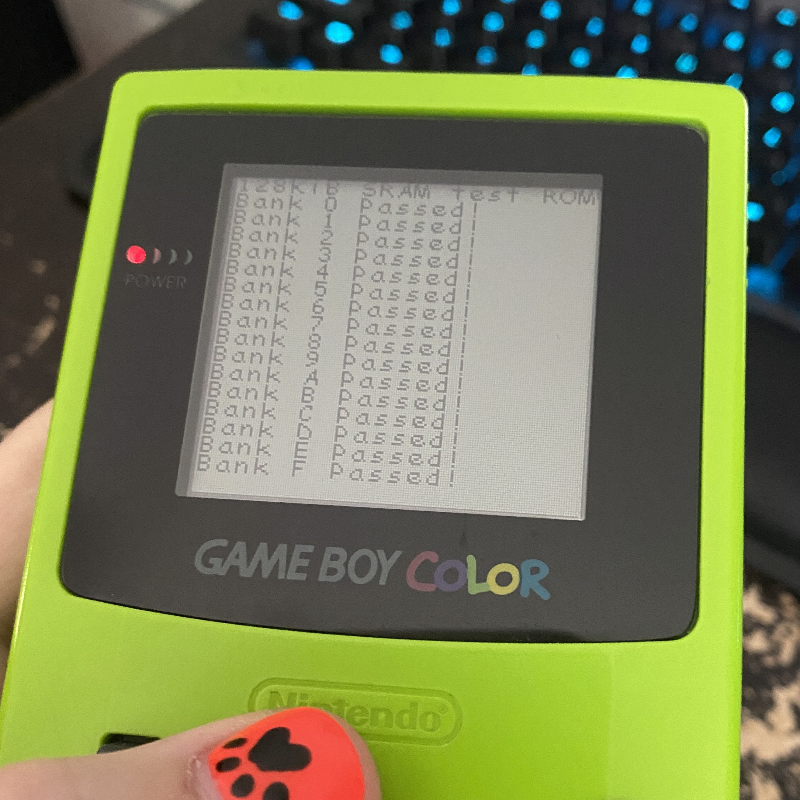
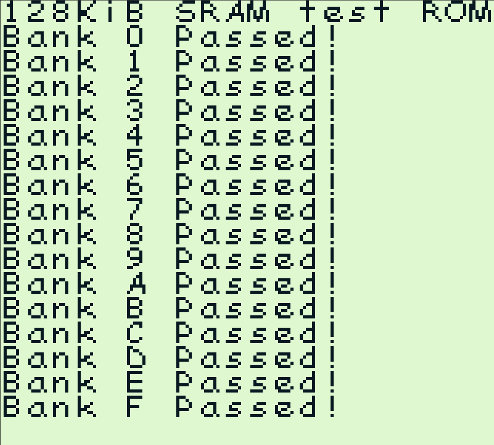
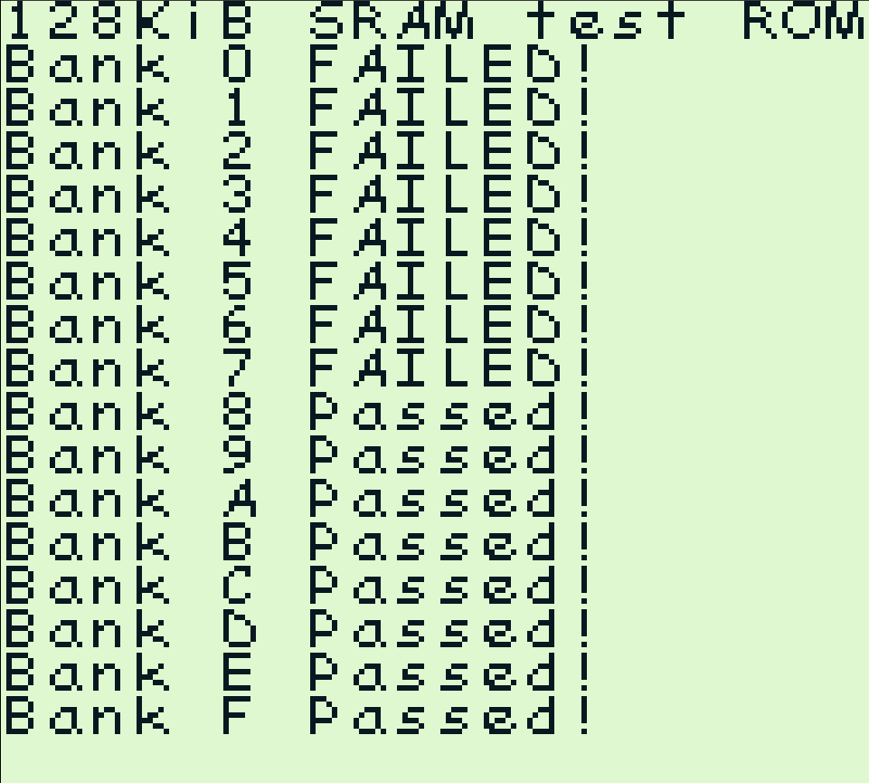

# SRAM128

A program for verifying that all 128 KiB of SRAM are readable and writeable.

Here's the test running on on Everdrive x5:

An example of a passing test:

An example of a test failing because only 64KiB of SRAM are present:
